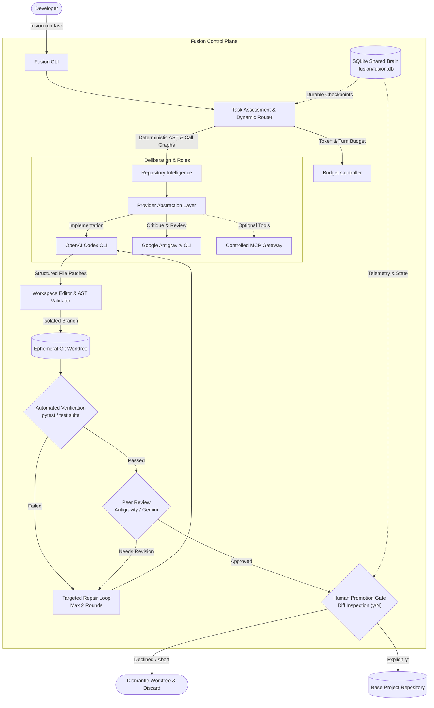
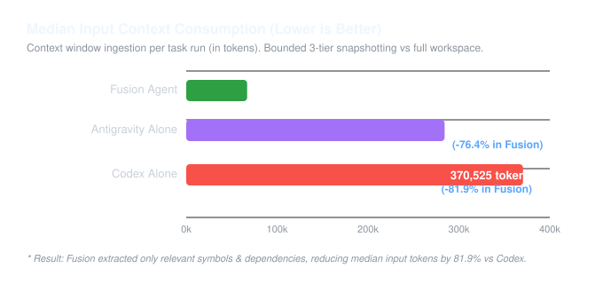
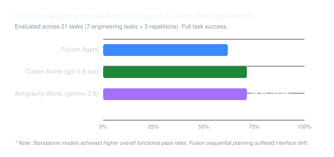
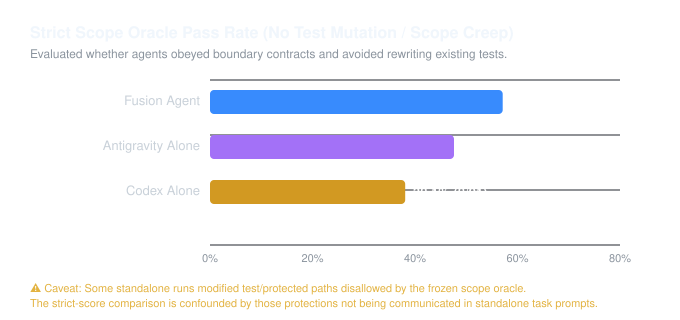

# Fusion Agent

**Provider-agnostic AI coding-agent control plane that dynamically orchestrates multiple coding models while owning context, repository edits, verification, review, recovery, budgets, and human approval.**

[](https://www.python.org/downloads/)
[](#cli-reference)
[](#architecture)
[](#evaluation--benchmark-summary-milestone-11)

---

## At a Glance

Fusion Agent solves the fundamental control-plane problem of autonomous coding agents: **how to leverage multiple foundation models (such as OpenAI Codex and Google Antigravity/Gemini) without suffering from runaway token costs, unconstrained filesystem writes, test-suite mutation, or unrecoverable failures.**

```bash
# 1. Install Fusion Agent in development mode
pip install -e .

# 2. Verify environment tooling & discover provider CLIs non-destructively
fusion doctor

# 3. Initialize project metadata and state tracking in your repository
fusion init

# 4. Execute a coding task with automated verification & peer review
fusion run "Add input validation to the signup endpoint"
```

---

## Architecture Overview



---

## Why Fusion Agent?

Standalone benchmark arms relied primarily on provider-native behavior, while Fusion centrally owned bounded context selection, change scope, verification, checkpoints, review and promotion:

| Capability | Evaluated Standalone Configuration (Provider-Native) | Fusion Agent (Centrally Governed Control Plane) |
| :--- | :--- | :--- |
| **Context Ingestion** | Relied on provider-native whole-file or full-repository ingestion; higher token spend. | **3-tier bounded snapshotting** (AST definitions, symbol call graphs, imports); **81.9% token reduction**. |
| **Filesystem Access** | Relied on direct workspace writes without external isolation; risk of dirty tree pollution. | **Ephemeral Git worktrees** (`git worktree add`); active working branch is never modified during runs. |
| **Verification Gate** | Relied on unassisted generation or model self-reporting without automated suite execution. | **Automated host test runner** (`pytest`/configured suite) executed inside isolated worktree. |
| **Quality & Peer Review** | Standalone models reviewed their own output or omitted review. | **Cross-model peer review / critique** with bounded repair loops (capped at 2 rounds). |
| **Scope Discipline** | Lacked central scope enforcement; some runs modified test/protected paths without boundary guardrails. | **Mathematical scope contract** forbidding test mutation or unrequested file creation. |
| **Recovery & Checkpoints** | Relied on provider-native session persistence without external state engine. | **Durable SQLite WAL journal**; durable task resumption across checkpointed and crash-injection scenarios (`fusion resume <task-id>`). |
| **Promotion Authority** | Direct commits or manual diff inspection without centralized gate. | **Mandatory human confirmation gate** with interactive unified diff inspection (`[y/N]`). |

> **Important**: Fusion does not claim to make underlying model weights smarter. Rather, it provides the deterministic scaffolding, state management, and safety boundaries necessary to run autonomous coding tasks reliably.

---

## Supported Providers

Fusion interacts with coding models via a pluggable provider interface (`ProviderInterface`), abstracting local CLIs and test doubles:

| Provider | Type | Typical Role | Default Model | Configuration Key |
| :--- | :--- | :--- | :--- | :--- |
| **OpenAI Codex CLI** | `codex_cli` | Implementation / Refactoring | `gpt-5.6-sol` | `agents.codex` |
| **Google Antigravity CLI** | `antigravity_cli` | Peer Review / Architecture | `gemini-3.8-flash-high` | `agents.antigravity` |
| **Google Gemini CLI** | `gemini_cli` | Analysis / Review | `gemini-2.5-pro` | `agents.gemini` |
| **Mock Provider** | `mock` | Hermetic Offline Testing | `mock-reasoning-v1` | `agents.mock` |

---

## Installation & Setup

### Prerequisites
- **Python**: Version 3.11 or higher
- **Git**: Version 2.0 or higher
- **Providers**: OpenAI Codex CLI (`codex`) or Google Antigravity CLI (`agy`) installed on PATH (or configured via environment variables).

### Install via Pip
```bash
git clone https://github.com/archestra/archestra.git
cd archestra

# Create and activate virtual environment
python -m venv .venv

# Windows
.venv\Scripts\activate
# Linux / macOS
source .venv/bin/activate

# Install editable package
pip install -e .
```

Verify the installation:
```bash
fusion --version
# Output: Fusion Agent v0.12.0
```

### Running Tests
To run the automated regression test suite:
```bash
python -m pytest -q
```

### Development & Contributing
Contributions and local enhancements are welcome:
1. Clone the repository and create a virtual environment (`python -m venv .venv`).
2. Install in editable mode with development dependencies: `pip install -e .`
3. Execute tests before submitting changes: `python -m pytest -q`
4. Verify code formatting and whitespace cleanliness: `git diff --check`
5. Adhere to core architecture invariants: host-trusted non-adversarial execution, Git worktree isolation, SQLite durable checkpointing, and structured model edit generation.

---

## CLI Reference

Fusion provides a clean, predictable command-line interface:

| Command | Description |
| :--- | :--- |
| `fusion doctor` | Non-destructive diagnostics: Python, Git, SQLite writability, Codex/Antigravity discovery, config validation. |
| `fusion init` | Initializes `.fusion/` directory, starter configuration, and updates `.gitignore` for runtime state. |
| `fusion providers` | Tests and lists configured providers with real-time latency and health checks. |
| `fusion status` | Displays active project mode, verification command, configured agents, and recent task memory. |
| `fusion config` | Displays safe, credential-redacted configuration (`--validate` to check schema). |
| `fusion run "<task>"` | Runs a coding task in an ephemeral worktree with automated testing, review, diff display, and human approval. |
| `fusion resume <id>` | Resumes an interrupted task from its last persisted SQLite checkpoint. |
| `fusion interactive` | Launches an interactive REPL session with the orchestrator. |
| `fusion mcp` | Lists, inspects, and health-checks Model Context Protocol (MCP) tool servers. |

---

## Evaluation & Benchmark Summary (Milestone 11)

In Milestone 11 Phase C, Fusion Agent was evaluated in a frozen, 63-run held-out comparative benchmark against standalone frontier models across 7 diverse software engineering tasks (3 repetitions each):

| System | Functional Correctness | Strict Scope Oracle | Median Input Tokens |
| :--- | :---: | :---: | :---: |
| **Fusion Agent** | 61.9% (13/21) | **57.1% (12/21)** | **66,980** |
| **OpenAI Codex Alone** (`gpt-5.6-sol`) | **71.4% (15/21)** | 38.1% (8/21)* | 370,525 |
| **Antigravity Alone** (`gemini-3.8-flash-high`) | **71.4% (15/21)** | 47.6% (10/21)* | 284,316 |

*(Timing Note: Task durations are omitted from headline comparisons because execution substrates differed across evaluation arms—including containerized execution for Antigravity versus host execution for Codex and Fusion—rendering duration exploratory and non-apples-to-apples. Do not present timing numbers as evidence that Fusion is intrinsically 3–4× faster).*

*(Scope Oracle Note: Some standalone runs modified test/protected paths disallowed by the frozen scope oracle. The strict-score comparison is confounded by those protections not being communicated in standalone task prompts).*

### Benchmark Visualizations

<p align="center">
  
  
</p>
<p align="center">
  
</p>

### Empirical Findings:
- **Input Context Efficiency**: Fusion consumed **81.9% fewer median input tokens than Codex** (66,980 vs. 370,525) and **76.4% fewer median input tokens than Antigravity** (66,980 vs. 284,316) by extracting bounded symbol call graphs rather than ingesting entire repositories.
- **Functional Correctness Trade-off**: Standalone single-model baselines achieved higher overall functional pass rates on this suite (Codex 15/21, Antigravity 15/21 vs. Fusion 13/21). While multi-agent deliberation caught defects, sequential multi-step planning introduced **interface drift** across step boundaries.
- **Scope Discipline & Governance**: Standalone benchmark arms relied primarily on provider-native behavior, while Fusion centrally owned bounded context selection, change scope, verification, checkpoints, review and promotion. Some standalone runs modified test/protected paths disallowed by the frozen scope oracle. The strict-score comparison is confounded by those protections not being communicated in standalone task prompts.
- **Exploratory Timing Substrate Caveat**: Median durations (Fusion 70.4s, Codex 248.9s, Antigravity 244.3s) were measured across differing execution substrates (including containerized Antigravity versus host execution for other arms) and are strictly exploratory, not evidence of an intrinsic speed advantage.
- **Reproducibility**: All chart assets are reproducible via `python docs/assets/generate_charts.py`.

---

## Configuration & Precedence

Fusion resolves configuration deterministically using a 5-tier precedence hierarchy:

```
1. CLI Arguments (--dir, --debug, --no-promote)
     └── 2. Project Config (.fusion/config.json)
           └── 3. User Config (~/.fusion/config.json)
                 └── 4. Environment Variables (FUSION_*, CODEX_CLI_PATH, ANTIGRAVITY_CLI_PATH)
                       └── 5. Built-in Defaults
```

### Separation of Project Config & Runtime State
- **Committed to Version Control**: `.fusion/config.json` contains shared team settings (project name, optimization mode, verification command, logical provider names, models, turn budgets).
- **Ignored from Version Control**: `.fusion/fusion.db`, `.fusion/*.log`, `.fusion/worktrees/`, `.fusion/temp/`, `.fusion/locks/`.
- **Machine-Specific Paths & Secrets**: Executable paths (`CODEX_CLI_PATH`) and sensitive tokens belong in user-global config (`~/.fusion/config.json`) or environment variables, keeping project configs portable and safe.

---

## Safety & Isolation Boundaries

Fusion enforces distinct safety boundaries for repository integrity and change governance. **Fusion does not provide a general OS sandbox.**

- **Repository & Policy Isolation (Git Worktrees)**: Autonomous edits execute strictly within ephemeral Git worktrees (`git worktree add`). Your active working tree and uncommitted files are never directly modified during deliberation or repair.
- **Execution Trust Model (Host-Trusted / Non-Adversarial)**: Native execution of verifiers (e.g. `pytest`) and provider CLI subprocesses runs on the host system with the current user's privileges. This execution model is **host-trusted and non-adversarial** — it protects against accidental code destruction, dirty working tree pollution, and merge conflicts, not malicious adversarial code execution.
- **Optional Container Isolation**: Where untrusted code execution protection is required, container/Docker-based isolation can be explicitly configured and supported for isolated test execution.
- **Distinct Safety Boundaries**:
  1. **Filesystem & State Partitioning**: Fusion-owned runtime state (`.fusion/fusion.db`, `.fusion/locks/`) and project files are strictly partitioned.
  2. **Mandatory Human Approval Gate**: Verified changes are never automatically merged to the base repository. A human must inspect the generated unified diff, review verification results, and explicitly confirm promotion (`[y/N]`).
  3. **Secret Sanitization**: All terminal logs and persistence layers route through a sensitive data filter that automatically redacts API keys (`AIza...`, `sk-...`, `Bearer...`), tokens, and credentials.

---

## Architecture / Repository Tour

For engineering reviewers navigating the codebase:

| Subsystem | Directory / File | Description |
| :--- | :--- | :--- |
| **Router & Assessment** | [`fusion_agent/core/router.py`](fusion_agent/core/router.py) | Analyzes task complexity, evaluates risk levels, and assigns dynamic implementer/reviewer roles. |
| **Core Orchestrator** | [`fusion_agent/core/orchestrator.py`](fusion_agent/core/orchestrator.py) | Coordinates multi-agent deliberation, single-agent fast paths, bounded repair loops, and budget control. |
| **Repository Intelligence** | [`fusion_agent/repository/`](fusion_agent/repository/) | Extracts 3-tier bounded CodeContext (AST definitions, symbol call graphs, dependency graphs, secret filtering). |
| **Workspace & Editing** | [`fusion_agent/workspace/editor.py`](fusion_agent/workspace/editor.py) | Ephemeral Git worktree allocation, AST patch validation, and atomic filesystem changes. |
| **Verification Runner** | [`fusion_agent/workspace/verifier.py`](fusion_agent/workspace/verifier.py) | Executes local automated test commands within isolated worktrees and captures structured failure signals. |
| **Scope Contract Oracle** | [`fusion_agent/workspace/scope_contract.py`](fusion_agent/workspace/scope_contract.py) | Enforces boundary contracts forbidding unrequested file edits or test suite mutation. |
| **Durable State & Memory** | [`fusion_agent/memory/`](fusion_agent/memory/) | SQLite WAL database schema, migrations, task state transitions, and checkpoint resumption. |
| **Provider Adapters** | [`fusion_agent/providers/`](fusion_agent/providers/) | Pluggable interfaces for OpenAI Codex CLI, Google Antigravity CLI, Google Gemini CLI, and hermetic MockProvider. |
| **Controlled MCP Gateway** | [`fusion_agent/mcp/`](fusion_agent/mcp/) | Model Context Protocol tool registry with strict capability boundaries, audit logging, and health checks. |
| **CLI & Diagnostics** | [`fusion_agent/cli/`](fusion_agent/cli/) | CLI command parsing, `fusion doctor` diagnostics, formatted error reporting, and interactive promotion gate. |

---

## Demo Workflow

To test Fusion Agent safely without modifying production code, use the included calculator example:

```bash
cd examples/demo_calculator

# 1. Run doctor checks
fusion doctor

# 2. Initialize project state
fusion init

# 3. Execute a feature addition task
fusion run "Add power(base, exponent) function to src/calculator.py and test coverage in tests/test_calculator.py"
```

For the full turn-by-turn video recording guide and narration script, see [**`docs/DEMO.md`**](docs/DEMO.md).

---

## Engineering Deep-Dive & Interview Materials

- [**`docs/ENGINEERING.md`**](docs/ENGINEERING.md): In-depth architectural trade-offs, design rationale (why SQLite, why no vector DB, why dynamic roles, why worktrees are not OS sandboxes).
- [**`docs/PORTFOLIO.md`**](docs/PORTFOLIO.md): 30-second pitch, 2-minute technical walkthrough, 5 technical interview Q&As, and quantified resume bullets.

---

## Known Limitations

- **Raw Model Correctness**: Fusion bounds context and orchestrates review, but cannot compensate for fundamental reasoning failures of underlying foundation models on novel complex algorithms.
- **Interface Drift in Multi-Step Planning**: Decomposing complex tasks into sequential multi-step plans can lead to signature mismatches across step boundaries.
- **Native Host Execution Trust**: Subprocesses execute with user privileges; host-trusted execution protects against accidental damage, not adversarial code.
- **Provider Quotas**: Upstream LLM usage limits and token rate limits still apply to underlying CLI tools.
- **Evaluation Scope**: Milestone 11 evaluated 63 runs across 7 tasks; broader evaluation across diverse languages is part of future research.

---

## Roadmap

- **Milestone 13**: Portfolio showcase, public demonstration fixtures, comparative evaluation presentation, and developer onboarding materials.
- **Future Backlog (Post-M13)**: Direct remote cloud REST/gRPC service adapters (bypassing local CLI wrappers), containerized worker execution pools, and IDE plugins.

---

## License & Project Metadata

- **Suggested GitHub Description**: `Provider-agnostic AI coding-agent control plane that dynamically orchestrates multi-model collaboration with worktree isolation, automated verification, and human approval.`
- **Suggested Topics**: `ai-agent`, `coding-assistant`, `multi-agent-orchestration`, `llm-orchestration`, `codex`, `antigravity`, `developer-tools`, `git-worktree`, `sqlite`, `mcp`
- **License Status**: *License selection is currently pending maintainer decision. No license has been finalized for the public release.*
